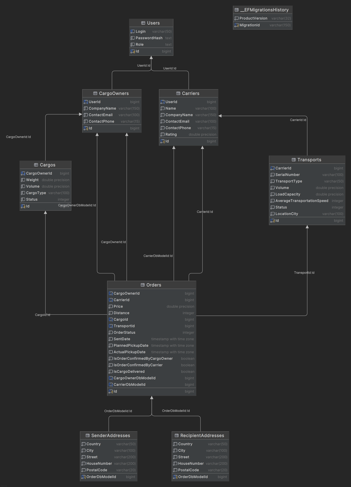
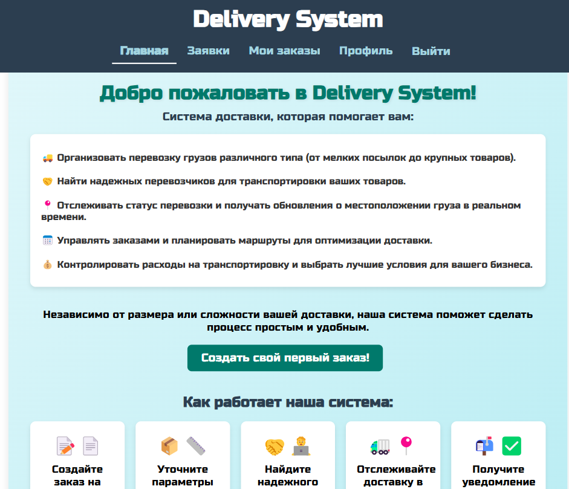
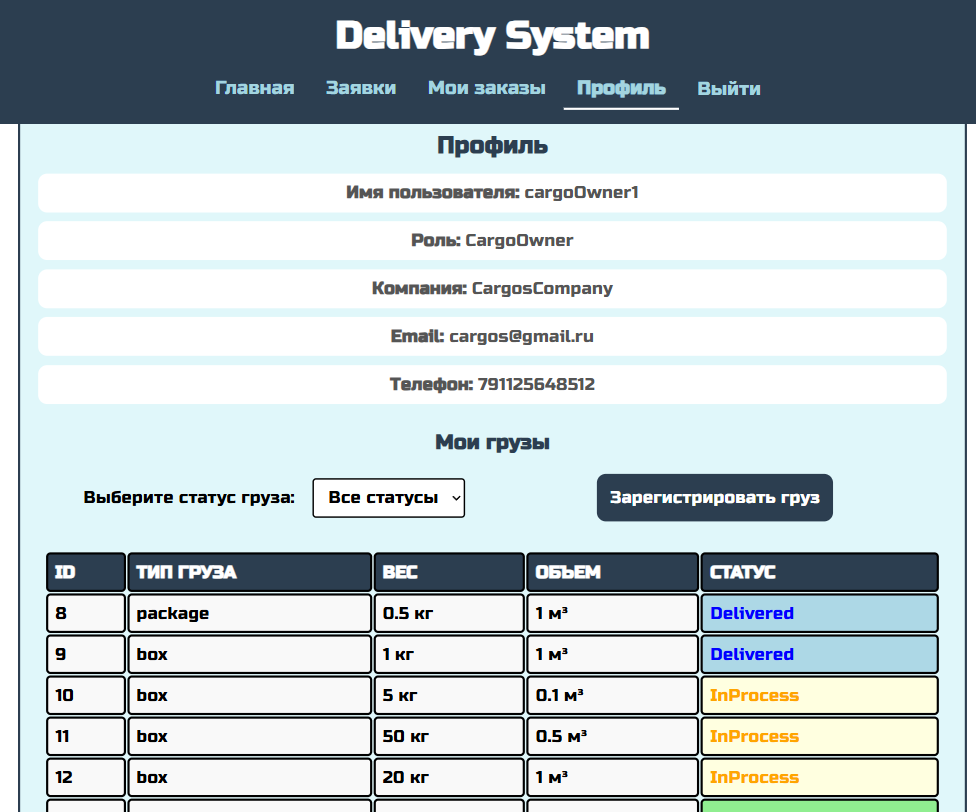
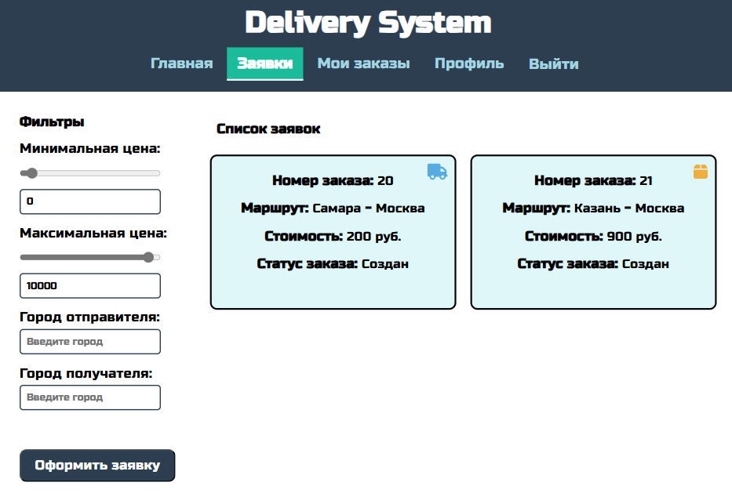
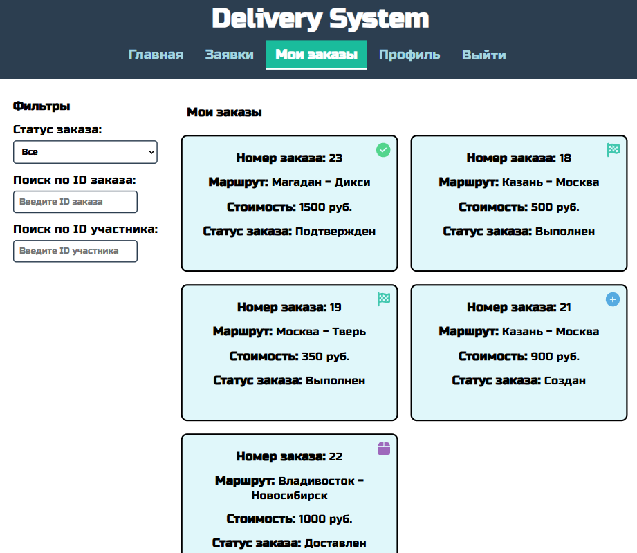

# 🚀 Delivery System

## 📜 Описание проекта
**Delivery System** – это удобная система управления заказами доставки, которая связывает **грузовладельцев** и **перевозчиков**.

### 🎯 Основные возможности:
- 📌 **Создание и управление заявками** на перевозку
- 🚛 **Регистрация грузов и транспортных средств**
- 🔍 **Фильтрация заказов** по статусу, стоимости и местоположению
- 🔑 **Аутентификация и работа в системе** в зависимости от роли
- 📦 **Отслеживание заказов** и управление ими

---

## 🛠️ Используемые технологии

### ⚙ Backend:
- 🟢 **.NET** – серверная часть
- 🗄 **PostgreSQL** – база данных
- 🔑 **Cookie-based authentication** – авторизация

### 🎨 Frontend:
- ⚛ **React** – клиентская часть
- 🛣 **React Router** – маршрутизация
- 🎨 **CSS (Less)** – стилизация
- 📡 **Axios** – работа с API

### 🏗 DevOps & Инфраструктура:
- 🐳 **Docker** – контейнеризация

---

## 🛢 Схема базы данных

📌 *Структура базы данных включает пользователей, заказы, грузы и транспортные средства.*  


---

## 🌟 Обзор функционала

### 🏠 **Домашняя страница**
Знакомит пользователя с системой и основными возможностями.  


### 👤 **Профиль пользователя**
Отображает данные о пользователе, зарегистрированных грузах и транспорте.  


### 📝 **Страница заявок**
Позволяет пользователю управлять отправленными и принятыми заявками.  


### 📦 **Страница заказов**
Список заказов с фильтрацией по статусу и другим параметрам.  


### 🔐 **Другие страницы**
Помимо указанных выше, система включает:  
✅ **Страницу авторизации и регистрации**  
✅ **Форму регистрации новых заявок**  
✅ **Страницу добавления грузов и транспортных средств**  
✅ **Просмотр деталей заказа и статусов**

---

## 🚀 Запуск проекта

#### Backend:
```sh
cd .\DeliverySystem-backend\
dotnet ef database upgrade
dotnet build
dotnen run
```

#### Frontend:
```sh
cd .\DeliverySystem-frontend\
npm run start
```

#### Также фронт и бд можно поднять через докер:
```sh
docker-compose up --build
```
